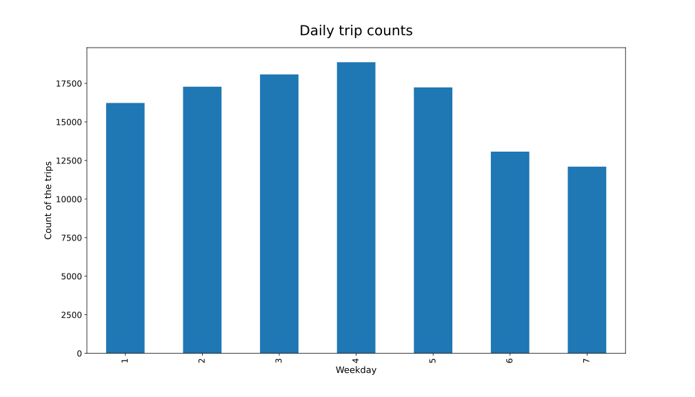
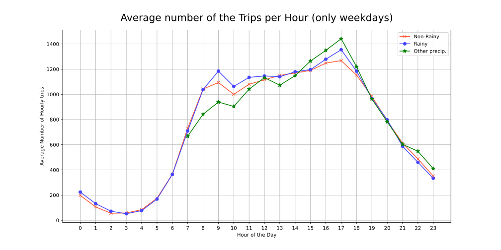
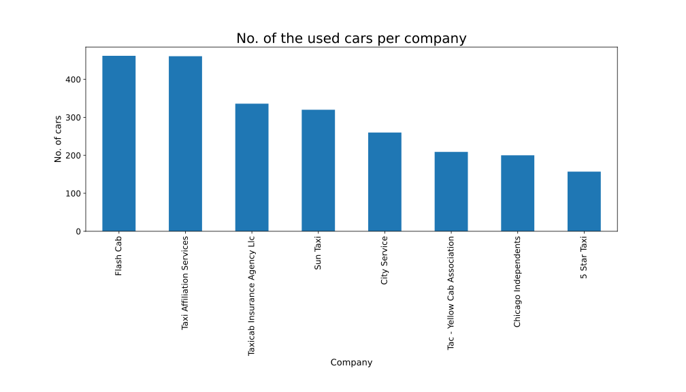
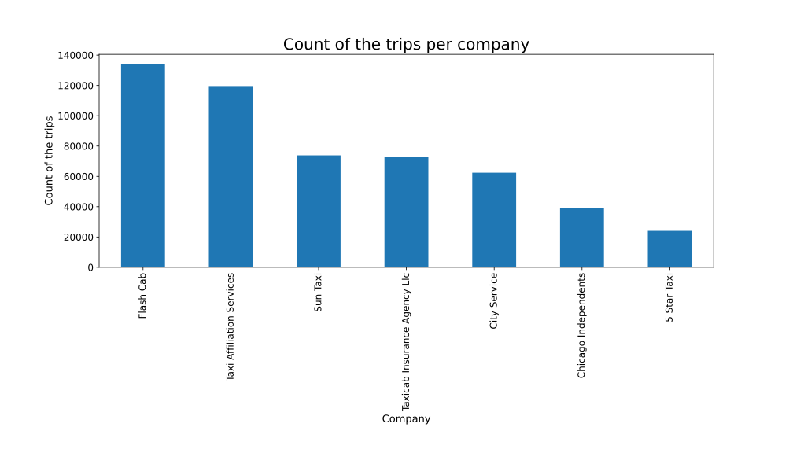
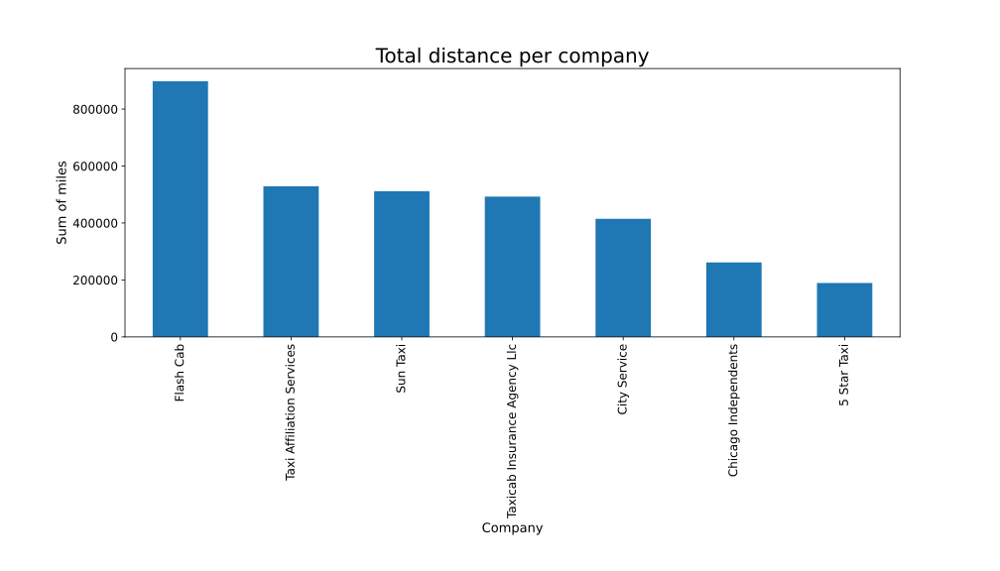

# Analysing the Taxi trips at Chicago
Created by Vizsy, István on May 27th, 2024

GitHub repo of the project: https://github.com/vizsyi/CUBIX_Data_engineer_course

### Table of Contents:
- [Project overview](#Project-overview)
  - [Process steps](#Process-steps)
  - [The sources of the data](#The-sources-of-the-data)
  - [Used tools](#Used-tools)
- [Visual Analysis](#Visual-Analysis)
  - [1. Analysing the weekdays](#1.-Analysing-the-weekdays)
  - [2. Rain effect on the hourly trips](#2.-Rain-effect-on-the-hourly-trips)
  - [3. Analysing the taxi companies in the period](#3.-Analysing-the-taxi-companies-in-the-period)
    - [3/a Counting the unique taxis per company](#3/a-Counting-the-unique-taxis-per-company)
    - [3/b The top companies with the largest number of the trips](#3/b-The-top-companies-with-the-largest-number-of-the-trips)
    - [3/c The top companies with the longest total distance](#3/c-The-top-companies-with-the-longest-total-distance)
    - [3/d The top companies with the bigest income](#3/d-The-top-companies-with-the-bigest-income)

## Project overview
This code was created as the final exam for the [CUBIX](https://courses.cubixedu.com/kepzesek) Data Engineering course.

The task is to analyse the taxi trips at Chicago and the weather effects.

### Process steps:

1. Extraxtion: AWS Lambda code collects the daily taxi trip data and the weather information through Web API. The data are cleaned and transformed to a csv file in a AWS S3 bucket's folder. A Python program on premise sraped the community areas of Chicago from web.

1. Transform and Load: and AWS Lambda code transforms and save the daily taxi trip and weather data to another S3 folder, updates the master data.

1. [Visual Analysis](#Visual-Analysis): Python program on premis reads back all the transformed csv files from S3 bucket and makes visualisasion using Matplotlib library.

### The sources of the data:
- [Open-Meteo - Free weather API](https://open-meteo.com/)
- [Chicago Data Portal](https://data.cityofchicago.org/)
- [Community areas in Chicago](https://en.wikipedia.org/wiki/Community_areas_in_Chicago)

Examined period: March 12, 2024 - April 20 (40 days)

### Used tools:
- AWS services: Lambda, S3, Glue, Crawlers, Athena
- Python 3.12.3
- Python libraries: Pandas, StringIO, OS, Request, Boto3, MatPlotLib
- Visual Studio Code
- Jupyter notebook
- [ChatGPT](https://chatgpt.com/)

## Visual Analysis

### 1. Analysing the weekdays

### 2. Rain effect on the hourly trips

I analysed the trips only on workdays to eliminate the difference of the weekend traffic.

As you can see the peak hour is between 17 and 18 o'clock.
The rain increases slightly the taxi traffic between 9 and 18 o'clock.

### 3. Analysing the taxi companies in the period
#### 3/a Counting the unique taxis per company

#### 3/b The top companies with the largest number of the trips

#### 3/c The top companies with the longest total distance

#### 3/d The top companies with the bigest income ($)

